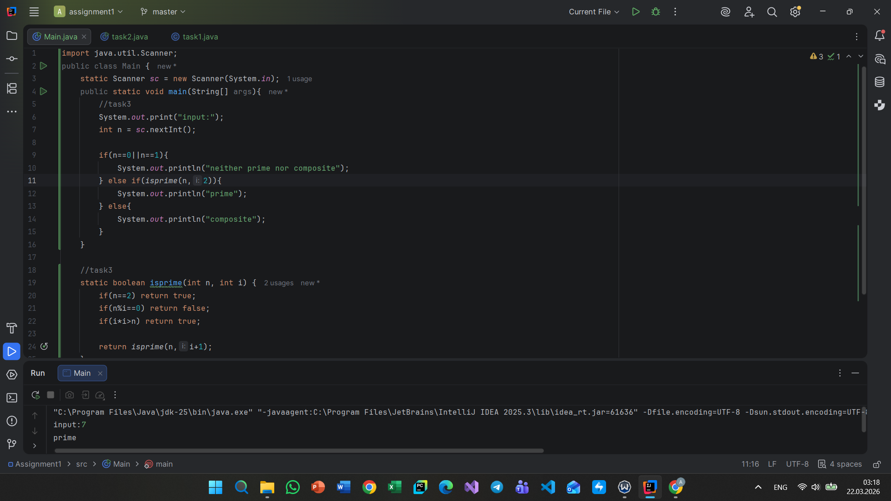
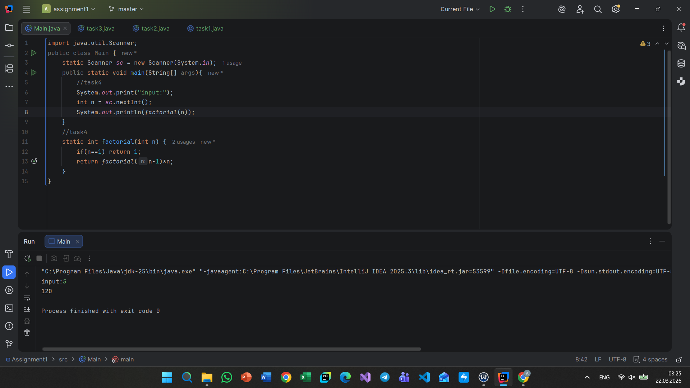
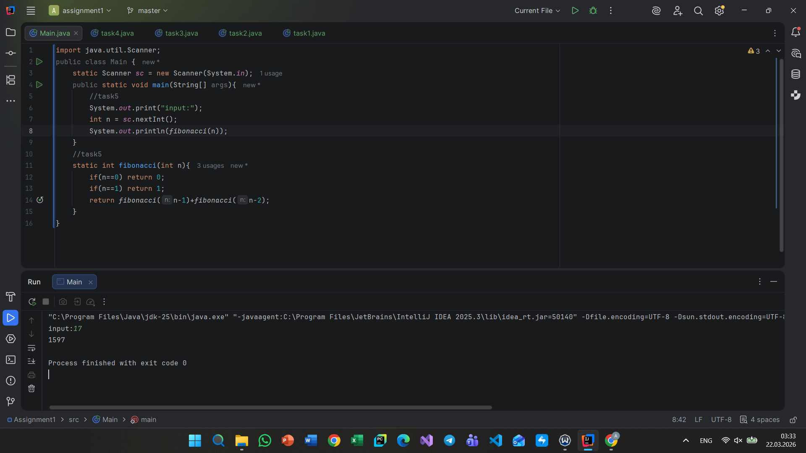
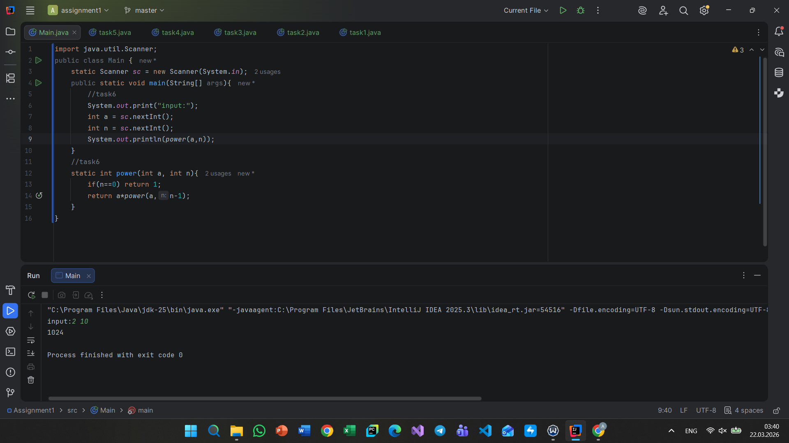
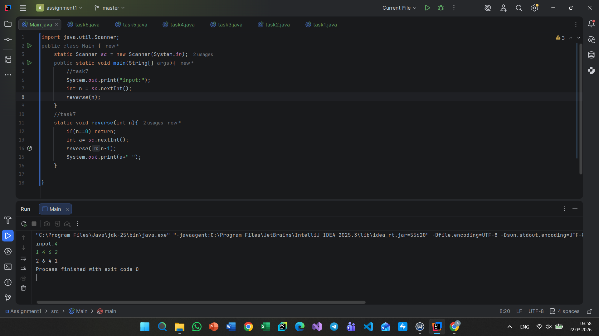
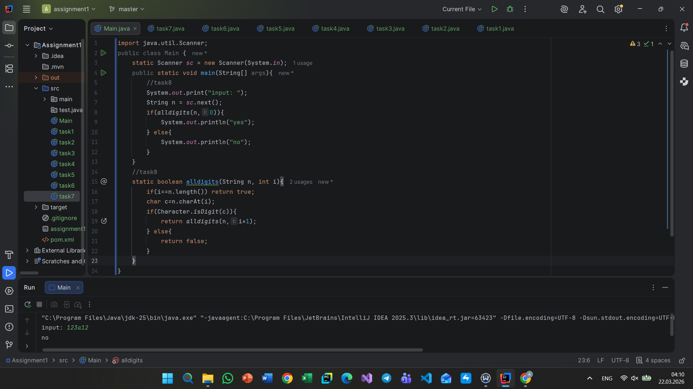
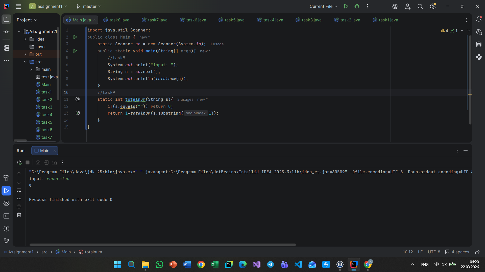
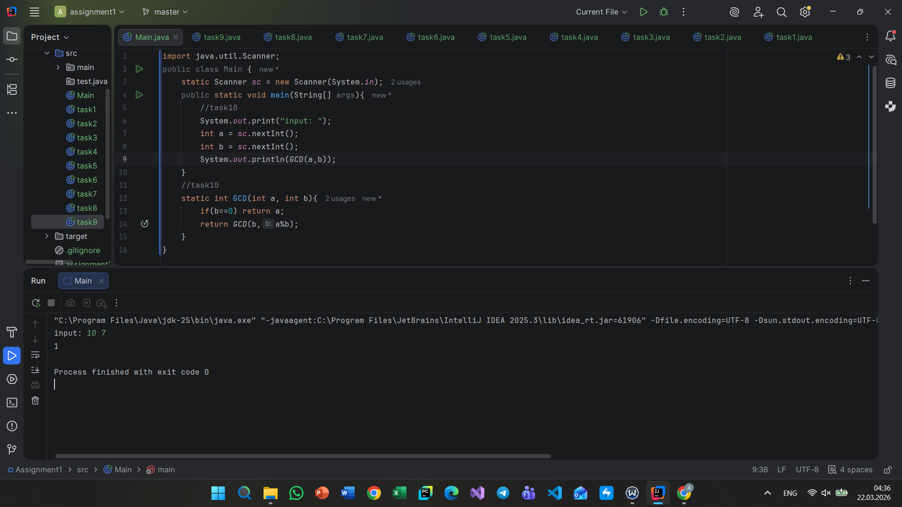

# Assignment 1 - Recursion

Name: Allazhar Aldongarov
Group: SE-2513

## Summary

In this assignment, I solved 10 tasks using recursion only.
Loops (for, while) were not used as required.
The tasks covered numbers, arrays, sequences, and strings.

## Task 1 – Print Digits

Explanation: Recursively divides the number and prints each digit.

Screenshot: task1.png

## Task 2 – Average of Elements

Explanation: Recursive function calculates sum, then average.

Screenshot: task2.png

## Task 3 – Prime Number

Explanation: Checks divisibility using recursion.

Screenshot:

---

## 📌 Task 4 – Factorial

Explanation: Uses recursive multiplication.

Screenshot:

---

## 📌 Task 5 – Fibonacci

Explanation: Each number is sum of previous two (recursive).

Screenshot:

---

## 📌 Task 6 – Power Function

Explanation: Multiplies number recursively.

Screenshot:

---

## 📌 Task 7 – Reverse Output

Explanation: Prints numbers in reverse using recursion.

Screenshot:

---

## 📌 Task 8 – Check Digits in String

Explanation: Checks each character recursively.

Screenshot:

---

## 📌 Task 9 – Count Characters

Explanation: Counts string length recursively.

Screenshot:

---

## 📌 Task 10 – GCD

Explanation: Uses Euclidean algorithm recursively.

Screenshot:

